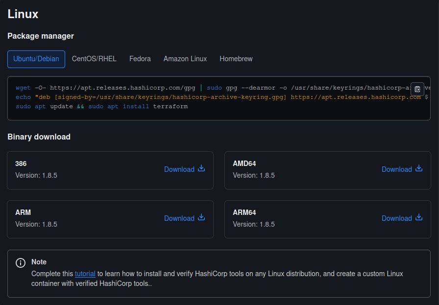

## Instalando e executando o Terraform
Agora que você já tem o AWS CLI instalado e configurado, vamos instalar o Terraform. O Terraform é uma ferramenta de infraestrutura como código (IaC) que permite criar, alterar e versionar infraestrutura de forma segura e eficiente.

### Instalação
Instalar o Terraform é um processo simples, mas um pouco chato. Primeiro, acesse o site do Terrafom [aqui](https://developer.hashicorp.com/terraform/install) e baixe o binário para o seu sistema operacional, no meu caso, é o AMD64 Linux.
> **Nota**: Esse método de instalação serve para todas as distribuições Linux, porque o Terraform pode não estar disponível em todos os gerenciadores de pacotes que existem, mas se você preferir, pode usar as instruções para a distribuição que você usa.



Depois de baixar o binário, vá até a pasta 'Downloads', extraia o arquivo e mova-o para o diretório `/usr/local/bin`:
```bash
cd ~/Downloads
unzip terraform_1.0.0_linux_amd64.zip
sudo mv terraform /usr/local/bin
```
Agora, verifique a instalação:
```bash
terraform --version
```
Se tudo estiver certo, você verá a versão do Terraform que acabou de instalar